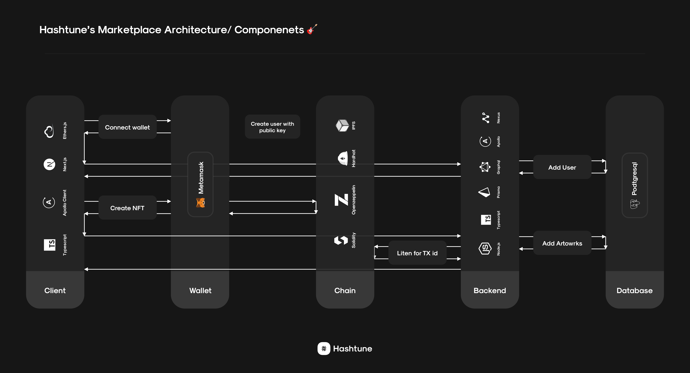

# **Hashtune Marketplace Chain**

---

## Architecture 🏛

The architecutre consists of 3 repositories:

1. Client Application https://github.com/hashtune/Hashtune-Marketplace-Client
2. Server https://github.com/hashtune/Hashtune-Marketplace-Server
3. Smart Contract (currently deployed to Binance Test Network) https://github.com/hashtune/Hashtune-Marketplace-Chain

Each repository has it's own steps for set up, development and testing.

---

## Setup 📦

`npm install` to install dependencies

#### .env.local

- Used with local tests with hardhat

#### .env.testnet

- Used with public test net tests
- The `CONTRACT=` variable was generated after running `npm run deploy:testnet`, it is the address that the contract was deployed at.
- The 3 other dummy address were copied from the addresses that were printed in the previous step. These accounts were generated using the mnemonic set in `harhat.config.ts` under networks testnet accounts. `ONE=` is the address of the contract deployer.
- To import the public key addresses from the previous step into MetaMask, you can use `ethers.Wallet.fromMnemonic(mnemonic);` to access the private key.

---

## Development 🚀

`npx hardhat watch compilation` to watch changes to /contracts/\*

In another terminal window:

`npm run dev:start` to watch changes to /scripts/\*.

---

## Testing 🧪

#### Locally on the Hardhat Network

`npm run test:hardhat` to run the tests on hardhats network

`UPDATE_SNAPSHOT=1 npx hardhat test` to update snapshots

#### Binance Test Network

- Assuming you have run `npm run deploy:testnet` (Note that you can change the length of time for each auction via a parameter inside the deploy.ts script) and then updated the contract address and three dummy addresses inside `.env.testnet` if necessary, you can run `npm test:ci`. You can also add tests to `ci.spec.ts`
- Note that you need to have binance test funds in these `.env.testnet` accounts in order to call contract functions. You can get that from https://testnet.binance.org/faucet-smart
- You can check the status of transactions on https://testnet.bscscan.com/
